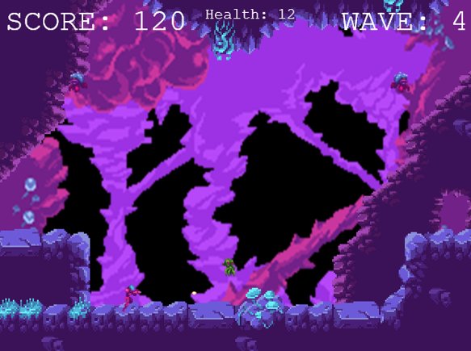

# Space-Wave-Defender

Space Wave Defender, A game made with Phaser3 Framework. Project started as a part of a workshop to familiarize its participants with everchanging and expanding methods of game programming. 

Player needs to survive four waves of aliens, with the number of enemies for each wave are increased, and confronting the boss after the fourth wave.

The Player has the ability to shoot, jump, and move, as well as charging its shoot, of which amount to five single shoot power. Enemy criters are programmed to follow the player without any other abilities and only have one 'health', whereas the boss have ten 'health' and seemingly able to dodge player's shoots by jumping randomly.

Graphic Assets used in development of this game such as sound and sprites are free assets, all credits of these assets belongs to their creators, and not mine.

